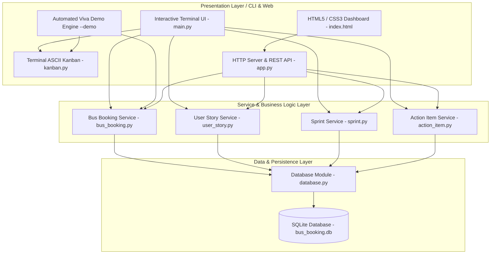
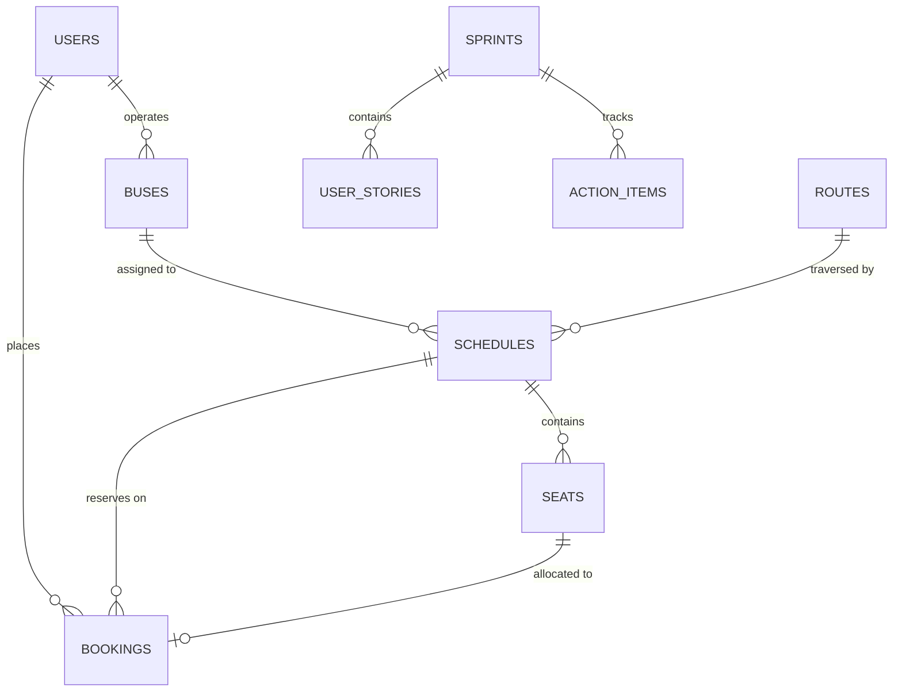
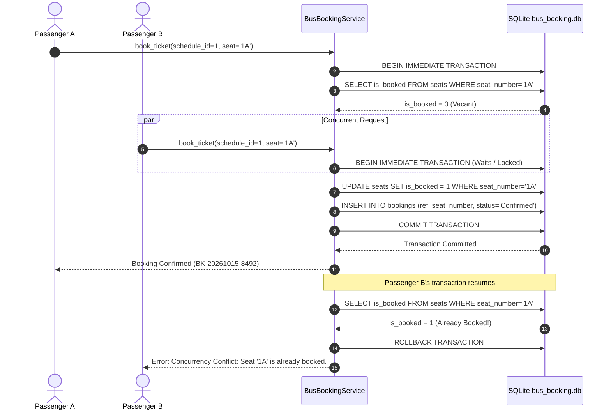
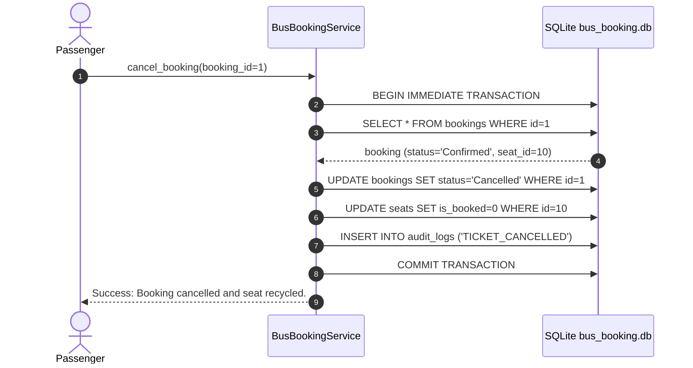

# System Design & Architecture
## Bus Booking System using Scrum Agile Methodology

---

## 1. System Architecture

The project is architected following a modular **3-Tier Layered Architecture**, separating user presentation, business rules, and persistent data storage.

---

## 2. Database Design & Entity-Relationship Diagram (ERD)

The system utilizes an embedded relational database (SQLite 3) with strict foreign key constraints enabled via `PRAGMA foreign_keys = ON;`.

---

## 3. Concurrency Lock Sequence Diagram (Atomic Seat Booking)

This sequence diagram illustrates how `US-08` achieves zero double-booking concurrency collisions using SQLite atomic transactions.

---

## 4. Ticket Cancellation & Immediate Seat Recovery Sequence

---

## 5. Security & Data Integrity Controls

1. **Cryptographic Protection:** Passwords are hashed using salted SHA-256 (`bus_scrum_salt_2026`), protecting against dictionary attacks and rainbow tables.
2. **Defensive Concurrency Guard:** The `book_ticket` method executes within an explicit `BEGIN IMMEDIATE;` block, checking seat status before applying modifications.
3. **Role-Based Access Control:** Differentiates `passenger`, `operator`, and `admin` permissions.
4. **Audit Logging:** All critical business events (`TICKET_BOOKED`, `TICKET_CANCELLED`, `SYSTEM_INIT`) are persisted in `audit_logs` for transparency.
